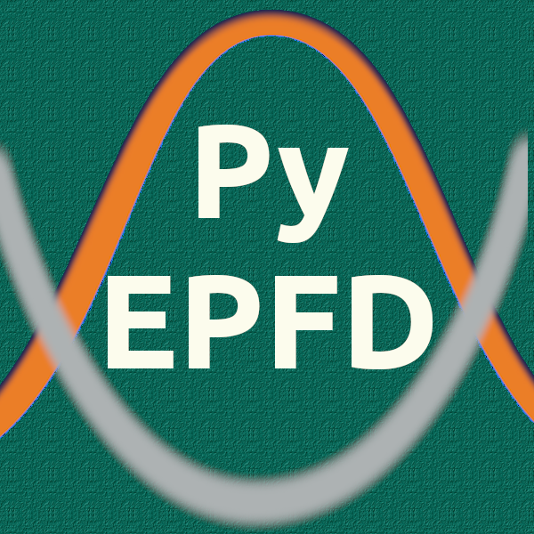

# PyEPFD Code Repository

Welcome to **PyEPFD** - A Python library for computing Electron-Phonon 
renormalizations from Finite Displacements (EPFD).

## Introduction

PyEPFD provides a set of tools to compute electronic properties, 
such as fundamental gap, at a finite temperature where 
nuclear quantum effects are incorporated using harmonic approximation. 
For that purpose, an additional ab-initio code is required that computes
the ab-initio forces and electronic properties such as eigenenergies of
the bands. PyEPFD also provides tools to analyze the validity of the 
harmonic approximation if a Molecular Dynamics and/or Monte Carlo 
trajectories are available. Currently, for the ab-initio part, PyEPFD 
depends on Qbox code (http://qboxcode.org/). However, it is very easy 
to use pyEPFD with any ab-inito code of your choice.     

## Features

PyEPFD can perform the following tasks:

(1) Compute normal-modes, dynamical matrix (mass-weighted Hessian matrix) 
using Cartesian Displacements.

(2) Compute normal-modes, dynamical matrix (mass-weighted Hessian matrix) 
using normal-mode Displacements.

(3) Compute phonon-renormalized electronic properties using a frozen-phonon
approach. [1]

(4) Perform stochastic displacements (e.g. thermal line sampling, 
Zacharias-Giustino's special displacement, etc.) on normal-modes [1-4] 
to compute thermally averaged properties at 0 K (including zero-point
quantum fluctuations) or any finite temperature. 

(5) If Molecular Dynamics or Monte Carlo trajectories 
(positions and/or forces) are available, vibrational densities along 
normal modes (see section S6 of ref. 5 for an example) or 
anharmonic measure [6] can be computed to understand the impact of
anharmonicity.

## Citation

If you have used PyEPFD for your work, please cite the follwoing papers:

(1) Kundu, A.; Govoni, M.; Yang, H.; Ceriotti, M.; Gygi, F.; Galli, G. 
Quantum vibronic effects on the electronic properties of solid and 
molecular carbon.  
*Phys. Rev. Materials* **2021**, *5*, L070801.

## References

[1] Monserrat, B. Electron-phonon coupling from finite differences. 
*J. Phys: Condens, Matter* **2018**, *30*, 083001.

[2] Monserrat, B. Vibrational averages along thermal lines.
*Phys. Rev. B* **2016**, *93*, 014302.

[3] Zacharias, M.; Patrick, C. E; Giustino, F. 
Stochastic approach to phonon-assisted optical absorption.
*Phys. Rev. Lett.* **2015**, *115*, 177401.

[4] Zacharias, M.; Giustino, F. 
One-shot calculation of temperature-dependent optical spectra 
and phonon-induced band-gap renormalization.
*Phys. Rev. B* **2016**, *94*, 075125

[5] Kundu, A.; Govoni, M.; Yang, H.; Ceriotti, M.; Gygi, F.; Galli, G.
Quantum vibronic effects on the electronic properties of solid and
molecular carbon.
*Phys. Rev. Materials* **2021**, *5*, L070801.

[6] Knoop, F.; Purcell, T. A. R.; Scheffler, M., Carbogno, C.
Anharmonicity measure for materials **2020**, *4*, 083809.

## Tutorials & Documentation

Installation instructions, Tutorials and Full Documentation is available
at the following location:

